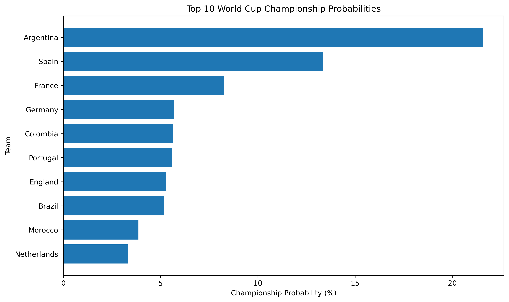
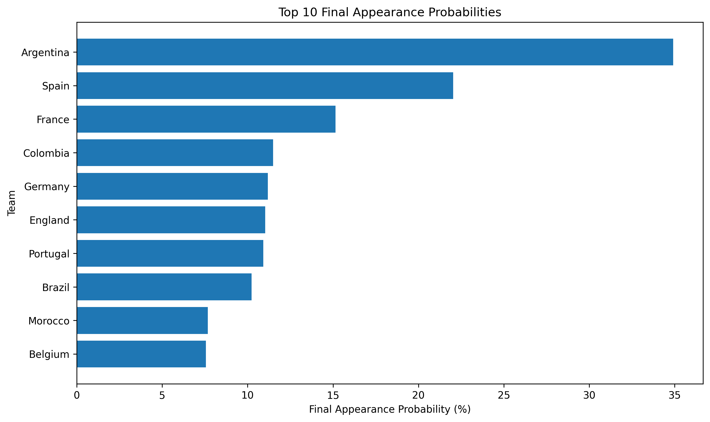
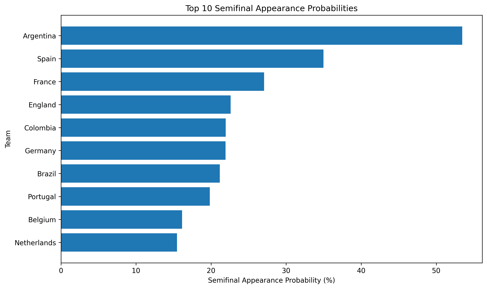

# FIFA World Cup 2026 Bracket Predictor

Check out the app [here](https://fifawcpredictor.streamlit.app/)!

This project is a sports analytics and machine learning pipeline for predicting international football match outcomes and simulating the knockout stage of the 2026 FIFA World Cup.

The model predicts match outcomes from Team A's perspective:

- Team A win
- Draw
- Team A loss

Those probabilities are then converted into knockout advancement probabilities and used to simulate a full bracket.

## Streamlit Web App

Built an interactive Streamlit app for exploring 2026 World Cup knockout predictions.

The app includes:

- Single-match knockout predictor with Team A / Team B selection
- Deterministic bracket results using highest advancement probability
- Monte Carlo tournament simulation results
- Saved visualizations for championship, final, and semifinal probabilities

For stability, the deployed app reads precomputed CSV outputs instead of loading the trained model directly.

Run locally:

```bash
python -m streamlit run streamlit_app.py

## Project Goal

The main goal is to build an end-to-end machine learning workflow that can:

1. Process historical international football match data
2. Engineer recent-form and Elo-based features
3. Train and evaluate match prediction models
4. Predict knockout-stage matchups
5. Simulate the 2026 World Cup bracket
6. Estimate championship probabilities using Monte Carlo simulation

## Current Project Direction

The project originally started as a general World Cup prediction platform. The current focus is a more realistic and portfolio-ready version:

> Predict and simulate the 2026 World Cup knockout stage using historical international match data, recent team form, and Elo-based team strength features.

The model can now predict individual knockout matches, simulate a deterministic bracket, and run Monte Carlo simulations to estimate each team's probability of advancing through each stage.

## Current Pipeline

```text
data/raw/results.csv
        ↓
data/processed/matches_with_results.csv
        ↓
data/processed/team_matches.csv
        ↓
data/processed/team_matches_with_form.csv
        ↓
data/processed/matchup_training_data.csv
        ↓
data/processed/matchup_training_data_with_elo.csv
        ↓
data/processed/matchup_training_data_with_clean_elo.csv
        ↓
models/current_best_model_with_elo.pkl
models/current_best_model_with_elo_metadata.json
        ↓
src/knockout_predictor.py
src/bracket_simulator.py
        ↓
scripts/run_knockout_simulation.py
        ↓
data/processed/actual_deterministic_bracket_results.csv
data/processed/monte_carlo_knockout_simulation_results.csv
```

In plain English:

```text
Raw historical match data
→ Add match result labels
→ Convert matches into team-perspective rows
→ Add recent-form features
→ Create matchup-level training data
→ Test logistic regression baselines
→ Test tree-based models
→ Add Elo rating features
→ Clean and finalize the Elo-enhanced dataset
→ Save the best model
→ Predict knockout matchups
→ Simulate the bracket deterministically
→ Run Monte Carlo simulations
→ Estimate championship probabilities
```

## Project Structure

```text
fifa-world-cup-predictor/
│
├── data/
│   ├── raw/
│   │   └── results.csv
│   │
│   └── processed/
│       ├── matches_with_results.csv
│       ├── team_matches.csv
│       ├── team_matches_with_form.csv
│       ├── matchup_training_data.csv
│       ├── matchup_training_data_with_elo.csv
│       ├── matchup_training_data_with_clean_elo.csv
│       ├── final_elo_ratings.csv
│       ├── actual_deterministic_bracket_results.csv
│       └── monte_carlo_knockout_simulation_results.csv
│
├── notebooks/
│   ├── 01_data_exploration.ipynb
│   ├── 02_team_perspective_data.ipynb
│   ├── 03_recent_form_features.ipynb
│   ├── 04_matchup_training_data.ipynb
│   ├── 05_baseline_model.ipynb
│   ├── 06_tree_based_models.ipynb
│   ├── 07_add_elo_features.ipynb
│   ├── 08_finalize_model_with_elo.ipynb
│   └── 09_knockout_prediction_logic.ipynb
│
├── models/
│   ├── baseline_logistic_regression.pkl
│   ├── baseline_logistic_regression_balanced.pkl
│   ├── current_best_model_with_elo.pkl
│   └── current_best_model_with_elo_metadata.json
│
├── src/
│   ├── __init__.py
│   ├── knockout_predictor.py
│   └── bracket_simulator.py
│
├── scripts/
│   └── run_knockout_simulation.py
│
├── README.md
└── requirements.txt
```

## Completed Work

### Notebook 01: Data Exploration

Loaded historical international match data and created basic match result labels.

Created:

```text
data/processed/matches_with_results.csv
```

Main tasks completed:

- Loaded raw match data
- Inspected columns and data types
- Checked missing values
- Converted the date column
- Created match result labels
- Saved processed match-level dataset

### Notebook 02: Team-Perspective Dataset

Converted the original match-level data into team-perspective rows.

Original format:

```text
home_team | away_team | home_score | away_score
```

New format:

```text
team | opponent | goals_for | goals_against | result | points | goal_difference
```

Created:

```text
data/processed/team_matches.csv
```

Each match now appears twice: once from each team's perspective.

This structure makes it easier to calculate recent form and team-specific features.

### Notebook 03: Recent Form Features

Created rolling recent-form features for each team using only matches that happened before the current match.

Created:

```text
data/processed/team_matches_with_form.csv
```

Important feature-engineering detail:

```text
Rolling form features use shift(1) so the model only sees matches that happened before the current match.
```

This prevents data leakage.

Features created include:

```text
last_5_points_per_match
last_5_goals_for_per_match
last_5_goals_against_per_match
last_5_goal_difference_per_match
last_5_win
last_5_draw
last_5_loss
previous_matches
form_matches_used
```

### Notebook 04: Matchup-Level Training Dataset

Converted team-perspective data into one row per matchup.

Created:

```text
data/processed/matchup_training_data.csv
```

Each row represents:

```text
Team A vs Team B
```

The target column is:

```text
target = win / draw / loss
```

The target is from Team A's perspective.

Difference features include:

```text
last_5_points_per_match_diff
last_5_goals_for_per_match_diff
last_5_goals_against_per_match_diff
last_5_goal_difference_per_match_diff
last_5_win_diff
last_5_draw_diff
last_5_loss_diff
```

### Notebook 05: Baseline Logistic Regression

Trained the first baseline machine learning models.

Created:

```text
models/baseline_logistic_regression.pkl
models/baseline_logistic_regression_balanced.pkl
```

The data was split chronologically:

```text
Training data: matches before 2018
Testing data: matches from 2018 onward
```

This is more realistic than a random split because sports prediction models should train on past matches and predict future matches.

Evaluation included:

```text
accuracy
precision
recall
F1-score
macro F1
weighted F1
classification report
confusion matrix
prediction counts
actual vs predicted class distribution
```

## Logistic Regression Results

Several logistic-regression variations were tested:

```text
normal
balanced
mild_draw_boost
medium_draw_boost
strong_draw_boost
very_strong_draw_boost
```

| Model | Accuracy | Macro F1 | Win F1 | Loss F1 | Draw F1 | Predicted Wins | Predicted Losses | Predicted Draws |
|---|---:|---:|---:|---:|---:|---:|---:|---:|
| normal | 0.513 | 0.36 | 0.65 | 0.43 | 0.00 | 1081 | 280 | 0 |
| balanced | 0.484 | 0.44 | 0.60 | 0.49 | 0.22 | 650 | 475 | 236 |
| mild_draw_boost | 0.514 | 0.37 | 0.65 | 0.45 | 0.00 | 1034 | 327 | 0 |
| medium_draw_boost | 0.517 | 0.37 | 0.66 | 0.46 | 0.00 | 992 | 368 | 1 |
| strong_draw_boost | 0.447 | 0.44 | 0.54 | 0.38 | 0.39 | 461 | 185 | 715 |
| very_strong_draw_boost | 0.354 | 0.31 | 0.30 | 0.20 | 0.43 | 161 | 70 | 1130 |

## Key Finding From Logistic Regression

The normal logistic regression model had decent raw accuracy, but it completely ignored draws.

```text
Accuracy: 0.513
Predicted draws: 0
Draw F1: 0.00
```

Balanced logistic regression predicted draws more realistically, but lost raw accuracy.

```text
Accuracy: 0.484
Predicted draws: 236
Draw F1: 0.22
Macro F1: 0.44
```

This showed that raw accuracy alone is not enough for football prediction. A model can look decent by mostly predicting wins and losses while failing to model draws.

## Notebook 06: Tree-Based Models

After logistic regression, tree-based models were tested to capture more complex non-linear relationships.

Models tested:

```text
RandomForestClassifier
GradientBoostingClassifier
HistGradientBoostingClassifier
GradientBoostingClassifier with balanced sample weights
HistGradientBoostingClassifier with balanced sample weights
```

## Tree-Based Model Results

| Model | Accuracy | Macro F1 | Weighted F1 | Win F1 | Draw F1 | Loss F1 | Predicted Wins | Predicted Draws | Predicted Losses |
|---|---:|---:|---:|---:|---:|---:|---:|---:|---:|
| gradient_boosting_balanced | 0.458 | 0.445 | 0.472 | 0.553 | 0.314 | 0.468 | 2917 | 2892 | 2346 |
| hist_gradient_boosting_balanced | 0.458 | 0.444 | 0.472 | 0.553 | 0.308 | 0.472 | 2963 | 2824 | 2368 |
| logistic_balanced | 0.490 | 0.444 | 0.485 | 0.606 | 0.233 | 0.493 | 3717 | 1524 | 2914 |
| random_forest | 0.448 | 0.426 | 0.457 | 0.556 | 0.284 | 0.439 | 3254 | 2491 | 2410 |
| logistic_medium_draw_boost | 0.468 | 0.396 | 0.443 | 0.635 | 0.343 | 0.209 | 4378 | 3330 | 447 |
| gradient_boosting | 0.529 | 0.365 | 0.439 | 0.666 | 0.008 | 0.421 | 6604 | 12 | 1539 |
| logistic_normal | 0.526 | 0.361 | 0.436 | 0.663 | 0.000 | 0.420 | 6569 | 0 | 1586 |
| hist_gradient_boosting | 0.524 | 0.360 | 0.434 | 0.663 | 0.007 | 0.409 | 6625 | 13 | 1517 |

## Key Finding From Tree-Based Models

Tree-based models confirmed the same major tradeoff:

```text
The highest-accuracy models still tended to ignore draws.
Balanced models had lower raw accuracy but healthier class balance.
```

The best tree-based model before Elo was:

```text
gradient_boosting_balanced
```

It had the strongest macro F1 among the non-Elo models:

```text
Accuracy: 0.458
Macro F1: 0.445
Draw F1: 0.314
```

## Notebook 07: Elo Rating Features

The next major improvement was adding Elo ratings as a team-strength feature.

Created:

```text
data/processed/matchup_training_data_with_elo.csv
```

Added features:

```text
team_a_elo_before
team_b_elo_before
elo_diff
```

The main Elo feature used for modeling was:

```text
elo_diff = team_a_elo_before - team_b_elo_before
```

This gave the model a stronger estimate of overall team quality instead of relying only on recent form.

## Elo Model Results

| Model | Accuracy | Macro F1 | Weighted F1 | Win F1 | Draw F1 | Loss F1 | Predicted Wins | Predicted Draws | Predicted Losses |
|---|---:|---:|---:|---:|---:|---:|---:|---:|---:|
| gradient_boosting_balanced_with_elo | 0.566 | 0.526 | 0.567 | 0.687 | 0.310 | 0.582 | 3760 | 1949 | 2450 |
| hist_gradient_boosting_balanced_with_elo | 0.569 | 0.525 | 0.567 | 0.690 | 0.300 | 0.586 | 3803 | 1812 | 2544 |
| logistic_balanced_with_elo | 0.576 | 0.525 | 0.569 | 0.696 | 0.282 | 0.598 | 3972 | 1616 | 2571 |

## Key Finding From Elo

Adding Elo significantly improved the models.

Before Elo, the best macro F1 was about:

```text
0.445
```

After Elo, the best macro F1 was about:

```text
0.526
```

The strongest confirmed model from Notebook 07 was:

```text
gradient_boosting_balanced_with_elo
```

Although `logistic_balanced_with_elo` had slightly higher raw accuracy, `gradient_boosting_balanced_with_elo` was preferred because the project needs balanced class performance and useful probabilities for simulation, not just accuracy.

## Notebook 08: Finalize Model With Clean Elo

Notebook 08 cleaned the Elo-enhanced workflow before moving into prediction and simulation.

Main cleanup steps:

```text
Remove unplayed matches with missing scores
Rebuild Elo using only played matches
Prevent duplicate rows during Elo merging
Handle missing values cleanly
Retrain final candidate models
Select the best current model
Save the model and metadata
Create a reusable predict_match() function
```

Important cleanup decisions:

```text
Rows with missing match scores are removed before training.
Rows with missing Elo values are dropped.
Missing recent-form difference values are filled with 0.
```

The reasoning is:

```text
Missing scores should not be treated as draws.
Missing Elo usually means the Elo merge failed for that row.
Missing recent-form differences can reasonably be treated as neutral form difference.
```

Notebook 08 creates or updates:

```text
data/processed/matchup_training_data_with_clean_elo.csv
data/processed/final_elo_ratings.csv
models/current_best_model_with_elo.pkl
models/current_best_model_with_elo_metadata.json
```

## Notebook 09: Knockout Prediction and Simulation

Notebook 09 moves the project from match prediction into knockout-stage simulation.

The saved model predicts:

```text
Team A win
Draw
Team A loss
```

For knockout matches, the draw probability is converted into advancement probability using:

```text
Team A advances = Team A win probability + 0.5 × draw probability
Team B advances = Team B win probability + 0.5 × draw probability
```

Functions created:

```text
predict_match()
predict_knockout_match()
simulate_round()
make_next_round_matchups()
simulate_knockout_bracket()
sample_knockout_winner()
simulate_bracket_once()
run_monte_carlo_simulation()
```

Notebook 09 supports two types of bracket simulation:

### Deterministic Bracket Simulation

The deterministic simulator always advances the team with the higher advancement probability.

This produces one fixed predicted bracket.

### Monte Carlo Simulation

The Monte Carlo simulator randomly samples each match winner based on the model's advancement probabilities.

By running thousands of simulations, it estimates each team's probability of reaching each stage:

```text
Round of 16
Quarterfinals
Semifinals
Final
Champion
```

Created:

```text
data/processed/actual_deterministic_bracket_results.csv
data/processed/monte_carlo_knockout_simulation_results.csv
```

## Source Code Refactor

The main notebook logic was moved into reusable Python files.

### `src/knockout_predictor.py`

Contains the `KnockoutPredictor` class.

Responsibilities:

```text
Load saved model
Load model metadata
Load team form data
Load final Elo ratings
Resolve team names
Build match feature rows
Predict normal matches
Predict knockout matches
```

### `src/bracket_simulator.py`

Contains the `BracketSimulator` class.

Responsibilities:

```text
Simulate one round
Create next-round matchups
Simulate deterministic brackets
Sample knockout winners
Run Monte Carlo simulations
Return round advancement probabilities
```

### `scripts/run_knockout_simulation.py`

Runs the final prediction workflow from the command line.

Responsibilities:

```text
Load predictor
Load simulator
Run deterministic bracket simulation
Run Monte Carlo simulation
Save results
Print top championship probabilities
```

## Monte Carlo Simulation Results

The Monte Carlo simulation was run on the Round of 32 bracket using 10,000 simulations.

Top championship probabilities:

| Rank | Team | Round of 16 | Quarterfinals | Semifinals | Final | Champion |
|---:|---|---:|---:|---:|---:|---:|
| 1 | Argentina | 94.07% | 74.74% | 53.45% | 34.91% | 21.58% |
| 2 | Spain | 75.50% | 45.80% | 34.98% | 22.03% | 13.36% |
| 3 | France | 76.46% | 43.14% | 27.07% | 15.14% | 8.25% |
| 4 | Germany | 68.39% | 36.81% | 21.93% | 11.18% | 5.69% |
| 5 | Colombia | 90.17% | 53.95% | 21.95% | 11.50% | 5.63% |
| 6 | Portugal | 63.95% | 30.68% | 19.82% | 10.92% | 5.60% |
| 7 | England | 75.71% | 41.43% | 22.60% | 11.03% | 5.29% |
| 8 | Brazil | 55.35% | 37.34% | 21.16% | 10.24% | 5.17% |
| 9 | Morocco | 49.17% | 32.26% | 15.19% | 7.67% | 3.86% |
| 10 | Netherlands | 50.83% | 32.62% | 15.46% | 7.45% | 3.33% |

The model's top predicted championship contender was:

```text
Argentina — 21.58%
```

The next strongest contenders were:

```text
Spain — 13.36%
France — 8.25%
Germany — 5.69%
Colombia — 5.63%
Portugal — 5.60%
England — 5.29%
Brazil — 5.17%
```
## Visual Results

### Championship Probabilities



### Final Appearance Probabilities



### Semifinal Appearance Probabilities



## Results Interpretation

The simulation suggests that Argentina is the strongest overall favorite in this model, with the highest probability of reaching every major stage.

Spain and France also appear as strong contenders, while Germany, Colombia, Portugal, England, and Brazil form the next tier.

Some teams have strong early-round probabilities but much lower championship odds. For example:

```text
United States:
Round of 16 probability: 74.12%
Championship probability: 1.06%

Canada:
Round of 16 probability: 67.48%
Championship probability: 1.41%
```

This shows why full-bracket simulation is more informative than single-match prediction. A team may be favored in its first match but still have a difficult path to winning the tournament.

## Current Status

```text
Completed:
- Data exploration
- Team-perspective dataset
- Recent-form feature engineering
- Matchup-level training dataset
- Baseline logistic regression model
- Balanced logistic regression model
- Custom class-weight experiments
- Draw logic experiment
- Model comparison visualizations
- Tree-based model testing
- Balanced tree-based model testing
- Elo rating feature engineering
- Elo-enhanced model comparison
- Clean Elo finalization notebook
- Saved best model and metadata
- Knockout match prediction logic
- Deterministic bracket simulation
- Monte Carlo tournament simulation
- Reusable source code in src/
- Command-line simulation script

Current stage:
- Portfolio-ready MVP complete
- Next step is polishing, visualization, and optional model improvements
```

## Current Limitations

The current model is much stronger than the original baseline, but it is still not a final high-confidence football predictor.

Current limitations include:

```text
No FIFA ranking features yet
No opponent-adjusted form yet
No last-10-match form features yet
No tournament importance weighting yet
No advanced home/neutral-site adjustment yet
No head-to-head history yet
No squad/player availability data
No injury data
No xG or advanced match statistics
No betting market comparison
No probability calibration yet
No penalty shootout modeling yet
```

The current draw-to-advancement rule assumes that both teams are equally likely to advance if the model predicts a draw. This is a reasonable beginner assumption, but it could later be improved using Elo advantage, penalty shootout history, or extra-time strength.

## How to Run the Project

### 1. Clone the repository

```bash
git clone <repo-url>
cd fifa-world-cup-predictor
```

### 2. Create and activate a virtual environment

```bash
python3 -m venv .venv
source .venv/bin/activate
```

On Windows:

```bash
.venv\Scripts\activate
```

### 3. Install dependencies

```bash
pip install -r requirements.txt
```

### 4. Run the notebooks

```bash
jupyter notebook
```

Run the notebooks in order:

```text
01_data_exploration.ipynb
02_team_perspective_data.ipynb
03_recent_form_features.ipynb
04_matchup_training_data.ipynb
05_baseline_model.ipynb
06_tree_based_models.ipynb
07_add_elo_features.ipynb
08_finalize_model_with_elo.ipynb
09_knockout_prediction_logic.ipynb
```

### 5. Run the final simulation script

After the model and processed files have been created, run:

```bash
python scripts/run_knockout_simulation.py
```

This script runs:

```text
Deterministic bracket simulation
Monte Carlo tournament simulation
```

and saves:

```text
data/processed/actual_deterministic_bracket_results.csv
data/processed/monte_carlo_knockout_simulation_results.csv
```

## Main Files

### Raw Data

```text
data/raw/results.csv
```

Historical international football match results.

### Processed Data

```text
data/processed/matches_with_results.csv
```

Match-level data with result labels.

```text
data/processed/team_matches.csv
```

Team-perspective version of the match data.

```text
data/processed/team_matches_with_form.csv
```

Team-perspective data with recent-form features.

```text
data/processed/matchup_training_data.csv
```

Matchup-level dataset with recent-form difference features.

```text
data/processed/matchup_training_data_with_elo.csv
```

Matchup-level dataset with Elo features added.

```text
data/processed/matchup_training_data_with_clean_elo.csv
```

Cleaned Elo-enhanced dataset used for final model selection.

```text
data/processed/final_elo_ratings.csv
```

Latest Elo rating for each team after processing historical matches.

```text
data/processed/actual_deterministic_bracket_results.csv
```

Deterministic bracket prediction results.

```text
data/processed/monte_carlo_knockout_simulation_results.csv
```

Monte Carlo simulation results with round advancement and championship probabilities.

### Models

```text
models/baseline_logistic_regression.pkl
```

Initial logistic regression model.

```text
models/baseline_logistic_regression_balanced.pkl
```

Balanced logistic regression model.

```text
models/current_best_model_with_elo.pkl
```

Current best saved model using recent-form and Elo features.

```text
models/current_best_model_with_elo_metadata.json
```

Metadata for the current best model, including features, target column, split date, and metrics.

### Source Code

```text
src/knockout_predictor.py
```

Reusable prediction class for loading the model and predicting matches.

```text
src/bracket_simulator.py
```

Reusable simulation class for deterministic and Monte Carlo bracket simulation.

```text
scripts/run_knockout_simulation.py
```

Command-line script for running the final bracket simulation workflow.

## Notes

This project is still in progress, but the current version is a complete machine learning MVP.

The most important accomplishment is that the project now supports the full workflow:

```text
data collection
→ data cleaning
→ team-perspective transformation
→ recent-form feature engineering
→ matchup-level dataset creation
→ baseline modeling
→ model refinement
→ tree-based model testing
→ Elo feature engineering
→ model finalization
→ knockout match prediction
→ deterministic bracket simulation
→ Monte Carlo tournament simulation
```

The biggest modeling lesson is that raw accuracy alone is not enough. Some models achieve decent accuracy by mostly ignoring draws, which is not acceptable for a full football match-outcome predictor. Macro F1, draw F1, prediction distribution, and probability quality matter because the final simulator depends on meaningful probabilities for all three outcomes.

The next improvements would be probability calibration, more football-specific features, better draw-to-advancement logic, and eventually updating the model with real 2026 group-stage data.
